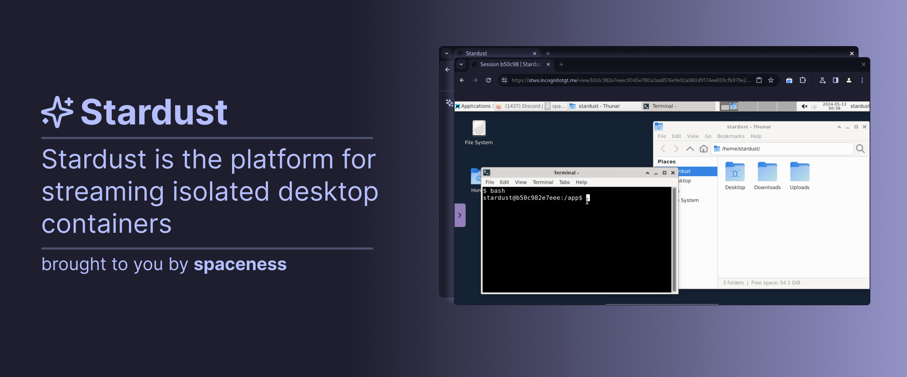

<p align="center">An open-source <a href="https://kasmweb.com">Kasm Workspaces</a> alternative.<br></p>
<hr>
<p align="center">Join our Discord server:</p>
<p align="center">
    <a href="https://discord.gg/xyW6kqrSf5">
        
    </a>
</p>
<br>

## Setup

Follow the steps below to set up Stardust.

First, install the dependencies:

```bash
pnpm i
```

If you encounter any errors, it might be because you do not have PostgreSQL. You can install PostgreSQL using your system's package manager.

Next, build the project:

```bash
pnpm build
```

Finally, start the project:

```bash
pnpm start
```

<hr>
🎉 There you have it, enjoy Stardust.
```
